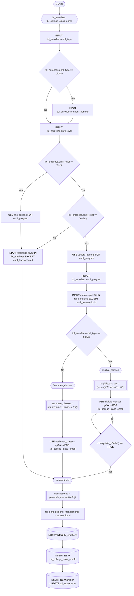

```mermaid
flowchart TD

start([START])
start --> dclr1{{"`tbl_enrollees, tbl_college_class_enroll`"}}
dclr1 --> flw1["`**INPUT** tbl_enrollees.enrll_type`"]
flw1 --> if1{"`tbl_enrollees.enrll_type == 'oldStu'`"}
if1 -- Yes --> flw2Y["`**INPUT** tbl_enrollees.student_number`"]
if1 -- No --> flw3
flw2Y --> flw3["`**INPUT** tbl_enrollees.enrll_level`"]
flw3 --> if2{"`tbl_enrollees.enrll_level == 'SHS'`"}
if2 -- Yes --> flw4Y["`**USE** shs_options **FOR** enrll_program`"]
if2 -- No --> if3{"`tbl_enrollees.enrll_level == 'tertiary'`"}
if3 -- Yes --> flw5Y["`**USE** tertiary_options **FOR** enrll_program`"]
flw5Y --> flw6["`**INPUT** tbl_enrollees.enrll_program`"]
flw6 --> flw6b["`
                **INPUT** *remaining fields* **IN** tbl_enrollees **EXCEPT** enrll_transactionId
                `"]
flw6b --> if4{"`tbl_enrollees.enrll_type == 'oldStu'`"}
if4 -- Yes --> dclr2{{eligible_classes}}
dclr2 --> subr1[["`eligible_classes = *get_eligible_classes_list()*`"]]
subr1 --> flw11["`**USE** eligible_classes ***options*** **FOR** tbl_college_class_enroll`"]
flw11 --> if5{"`corequisite_isValid() == **TRUE**`"}
if5 -- No --> flw11
    flw4Y --> flw4b["`
                **INPUT** *remaining fields* **IN** tbl_enrollees **EXCEPT** enrll_transactionId
                `"]
    if3 -- No --> flw4b
    flw4b --> dclr3

    if4 -- No --> dclr4{{"`freshmen_classes`"}}
    dclr4 --> subr2[["`freshmen_classes = *get_freshmen_classes_list()*`"]]
    subr2 --> flw12["`**USE** freshmen_classes ***options*** **FOR** tbl_college_class_enroll`"]
    flw12 --> dclr3
if5 -- Yes --> dclr3{{"`transactionId`"}}
dclr3 --> subr3[["`transactionId = *generate_transactionId()*`"]]
subr3 --> flw13["`tbl_enrollees.enrll_transactionId = transactionId`"]
flw13 --> db1[("`**INSERT NEW** tbl_enrollees`")]
db1 --> db2[("`**INSERT NEW** tbl_college_class_enroll`")]
db2 --> db3[("`**INSERT NEW** **and/or** **UPDATE** tbl_studentNfo`")]
```