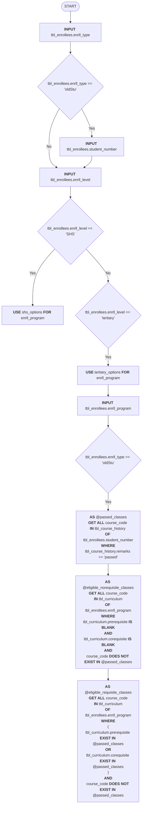

## Transaction Sequence for College Enrollees

```mermaid
    flowchart TD
        start([START])
        start --> flw1["`**INPUT** tbl_enrollees.enrll_type`"]
        flw1 --> if1{"`tbl_enrollees.enrll_type == 'oldStu'`"}
        if1 -- Yes --> flw2Y["`**INPUT** tbl_enrollees.student_number`"]
        if1 -- No --> flw3
        flw2Y --> flw3["`**INPUT** tbl_enrollees.enrll_level`"]
        flw3 --> if2{"`tbl_enrollees.enrll_level == 'SHS'`"}
        if2 -- Yes --> flw4Y["`**USE** shs_options **FOR** enrll_program`"]
        if2 -- No --> if3{"`tbl_enrollees.enrll_level == 'tertiary'`"}
        if3 -- Yes --> flw5Y["`**USE** tertiary_options **FOR** enrll_program`"]
        flw5Y --> flw6["`**INPUT** tbl_enrollees.enrll_program`"]
        flw6 --> if4{"`tbl_enrollees.enrll_type == 'oldStu'`"}
        if4 -- Yes --> flw7Y["`
                               **AS** @passed_classes
                               **GET ALL** course_code 
                               **IN** tbl_course_history 
                               **OF** tbl_enrollees.student_number
                               **WHERE**
                               tbl_course_history.remarks == 'passed'
                            `"]
        flw7Y --> flw8["`
                       **AS** @eligible_norequisite_classes
                       **GET ALL** course_code
                       **IN** tbl_curriculum
                       **OF** tbl_enrollees.enrll_program
                       **WHERE**
                       tbl_curriculum.prerequisite **IS BLANK**
                       **AND**
                       tbl_curriculum.corequisite **IS BLANK**
                       **AND**
                       course_code **DOES NOT EXIST IN** @passed_classes
                     `"]
        flw8 --> flw9["`
                       **AS** @eligible_requisite_classes
                       **GET ALL** course_code
                       **IN** tbl_curriculum
                       **OF** tbl_enrollees.enrll_program
                       **WHERE**
                       (
                        tbl_curriculum.prerequisite **EXIST IN** @passed_classes
                        **OR**
                        tbl_curriculum.corequisite **EXIST IN** @passed_classes
                        )
                       **AND**
                       course_code **DOES NOT EXIST IN** @passed_classes
                     `"]
```
